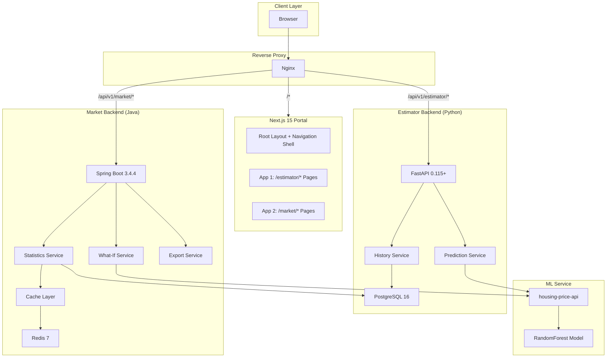
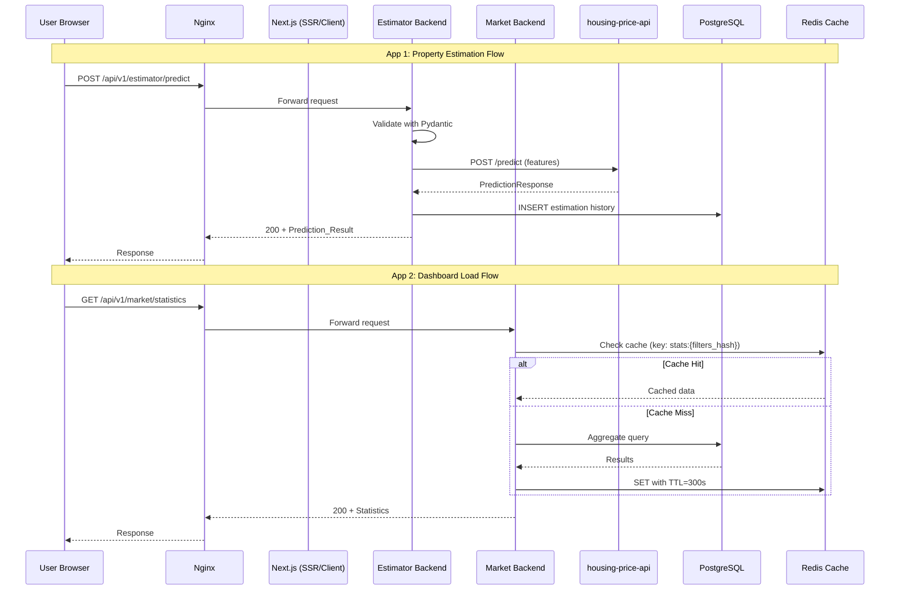
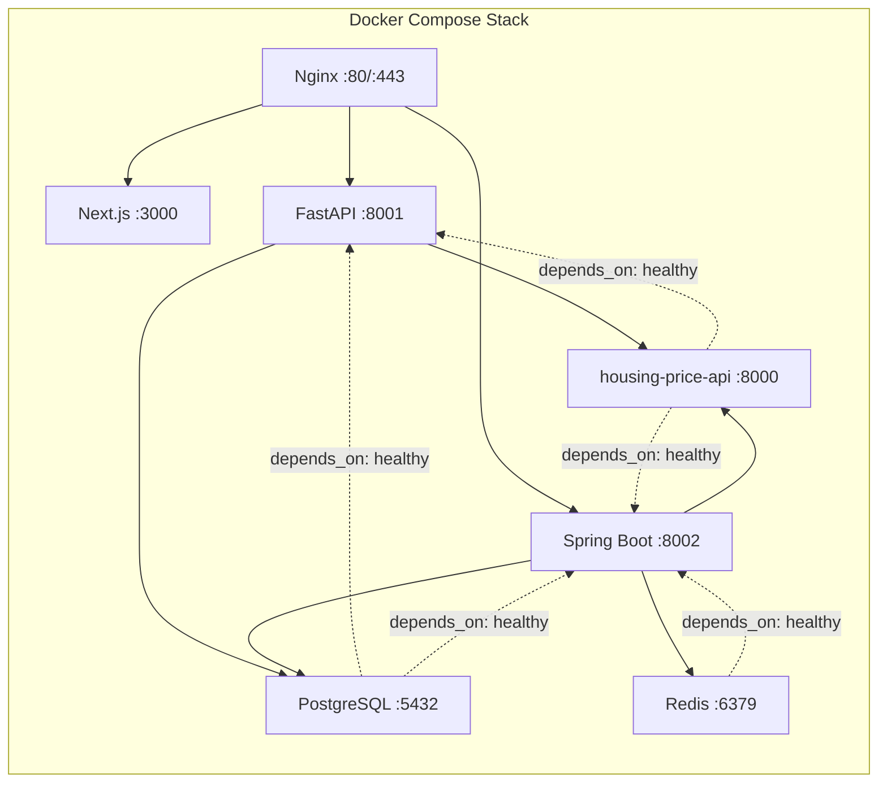
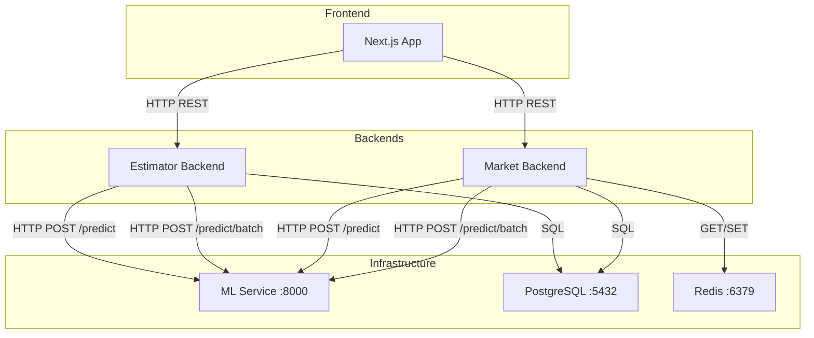
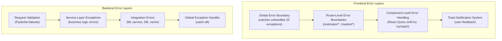

# Design Document: Multi-Application Next.js Portal

## Overview

This design document describes the architecture and technical implementation of a Multi-Application Next.js Portal that hosts two independent applications under a unified navigation shell:

- **App 1 (Property Value Estimator)**: A property valuation tool backed by a Python/FastAPI service that communicates with the existing `housing-price-api` ML model for single and batch predictions, stores estimation history in PostgreSQL, and presents results with feature importance charts.
- **App 2 (Property Market Analysis)**: A market analytics dashboard backed by a Java/Spring Boot service that provides aggregate statistics, what-if analysis, and data export (CSV/PDF), with a multi-layer caching strategy (Caffeine + Redis).

Both applications share a consistent design system (shadcn/ui + Tailwind CSS), responsive layout, and accessibility-compliant UI. The portal is deployed as a containerized stack via Docker Compose with Nginx reverse proxy.

### Key Design Decisions

| Decision | Rationale |
|----------|-----------|
| Next.js 15 App Router with route groups | Isolates App 1 and App 2 routing while sharing root layout and providers |
| Server Components for data-heavy pages, Client Components for interactivity | Optimizes initial load (SSR/streaming) while enabling rich client interactions |
| React Query (TanStack Query) for server state | Provides caching, deduplication, background refetch, and hydration from server to client |
| Zustand for client-only UI state | Lightweight, no boilerplate, works well alongside React Query |
| Zod for validation on both client and server | Single schema definition shared between React Hook Form and API contracts |
| Separate backends per app (FastAPI + Spring Boot) | Demonstrates polyglot architecture; each backend owns its domain logic and data |
| Nginx reverse proxy | Unified entry point, path-based routing to backends, SSL termination, static caching |

---

## Architecture

### High-Level System Architecture



### Request Flow



### Deployment Architecture



---

## Components and Interfaces

### Frontend Components

#### Navigation Shell

| Component | Type | Responsibility |
|-----------|------|----------------|
| `RootLayout` | Server | Wraps all pages with providers (QueryClientProvider, Zustand), renders `<html>` and `<body>` |
| `TopNav` | Client | Fixed top bar with app switcher, breadcrumb, mobile hamburger menu |
| `AppSwitcher` | Client | Tab-style navigation between Estimator, Market, and Home |
| `Breadcrumb` | Client | Displays current path up to 3 levels deep |
| `MobileMenu` | Client | Hamburger-triggered overlay menu for viewports < 768px |
| `Footer` | Server | Displays backend health status and app version |

#### App 1 Components (Estimator)

| Component | Type | Responsibility |
|-----------|------|----------------|
| `PropertyForm` | Client | React Hook Form + Zod validated input for all ML model fields |
| `PredictionResult` | Client | Displays predicted price card with currency, model version, timestamp |
| `FeatureImportanceChart` | Client | Recharts horizontal bar chart of feature importance scores |
| `HistoryTable` | Server | Paginated, searchable table of past estimations |
| `CompareView` | Client | Side-by-side comparison of 2–4 properties with grouped bar chart |
| `PropertyCard` | Server | Summary card for a single estimation in history/comparison |

#### App 2 Components (Market)

| Component | Type | Responsibility |
|-----------|------|----------------|
| `DashboardGrid` | Client | Responsive grid layout for chart widgets |
| `FilterPanel` | Client | Multi-select neighborhood, price range, year range, property type filters |
| `NeighborhoodBarChart` | Client | Recharts bar chart: average price by neighborhood |
| `PriceHistogram` | Client | Recharts histogram: price distribution (10–20 bins) |
| `PriceAreaScatter` | Client | Recharts scatter plot: price vs living area |
| `WhatIfTool` | Client | Sliders/inputs for each feature with live prediction updates |
| `SensitivityChart` | Client | Line chart showing price sensitivity to a single parameter |
| `MarketTable` | Server | Paginated, sortable, filterable property data table |
| `ExportButton` | Client | Triggers CSV/PDF export with progress indicator |

#### Shared Components

| Component | Type | Responsibility |
|-----------|------|----------------|
| `ErrorBoundary` | Client | Global and route-level error catching with recovery UI |
| `SkeletonLoader` | Server | Placeholder matching target component dimensions |
| `Toast` | Client | Notification system for success/error feedback (auto-dismiss 5s for success) |
| `DataTable` | Server/Client | Reusable table with pagination, sorting, column configuration |

### Backend Interfaces

#### Estimator Backend (FastAPI) API

| Endpoint | Method | Description |
|----------|--------|-------------|
| `/api/v1/estimator/predict` | POST | Single property prediction |
| `/api/v1/estimator/predict/batch` | POST | Batch prediction (2–4 properties for comparison) |
| `/api/v1/estimator/history` | GET | Paginated history with search/filter |
| `/api/v1/estimator/history/{id}` | GET | Single estimation detail |
| `/api/v1/estimator/health` | GET | Health check (DB + ML connectivity) |

#### Market Backend (Spring Boot) API

| Endpoint | Method | Description |
|----------|--------|-------------|
| `/api/v1/market/statistics` | GET | Aggregate statistics with filters |
| `/api/v1/market/dashboard` | GET | Dashboard widget data |
| `/api/v1/market/what-if` | POST | What-if prediction |
| `/api/v1/market/data` | GET | Paginated property data table |
| `/api/v1/market/export` | POST | Generate CSV/PDF export |
| `/api/v1/market/export/{jobId}/status` | GET | Export job status |
| `/api/v1/market/health` | GET | Health check (DB + Cache + ML) |

#### ML Service API (Existing)

| Endpoint | Method | Description |
|----------|--------|-------------|
| `/predict` | POST | Single prediction (HouseFeatures → PredictionResponse) |
| `/predict/batch` | POST | Batch prediction (BatchRequest → BatchPredictionResponse) |
| `/health` | GET | Health check |
| `/model/info` | GET | Model metadata and feature importance |

### Inter-Service Communication



---

## Data Models

### Frontend TypeScript Types

```typescript
// Shared ML model input features (matches housing-price-api HouseFeatures)
interface HouseFeatures {
  square_footage: number;
  bedrooms: number;
  bathrooms: number;
  year_built: number;
  lot_size: number;
  distance_to_city_center: number;
  school_rating: number;
}

// Prediction result from Estimator Backend
interface PredictionResult {
  estimate_id: string;
  predicted_price: number;
  currency: string;
  input_features: HouseFeatures;
  model_version: string;
  timestamp: string; // ISO 8601
  feature_importance: FeatureImportance[];
}

interface FeatureImportance {
  feature: string;
  importance: number; // percentage, sums to 100
}

// Batch prediction for comparison
interface BatchPredictionResult {
  results: PredictionResult[];
  comparison_summary: {
    highest_value: number;
    lowest_value: number;
    average_value: number;
    value_range: number;
  };
}

// History list item
interface HistoryItem {
  estimate_id: string;
  neighborhood: string;
  predicted_price: number;
  gr_liv_area: number;
  bedroom: number;
  full_bath: number;
  garage_cars: number;
  created_at: string;
}

// Paginated response envelope
interface PaginatedResponse<T> {
  items: T[];
  total: number;
  page: number;
  page_size: number;
  total_pages: number;
}

// Market statistics
interface MarketStatistics {
  overall: {
    count: number;
    avg_price: number;
    median_price: number;
    min_price: number;
    max_price: number;
  };
  by_neighborhood: { neighborhood: string; count: number; avg_price: number }[];
  price_distribution: { range: string; count: number }[];
  cached: boolean;
  generated_at: string;
}

// What-if response
interface WhatIfResult {
  base_prediction: { predicted_value: number };
  modified_prediction: { predicted_value: number };
  value_difference: number;
  percentage_change: number;
}

// Error response (unified across backends)
interface ApiError {
  error: {
    code: string;
    message: string;
    details?: { field: string; message: string }[];
    timestamp: string;
  };
}
```

### Estimator Backend (Python) - Pydantic Models

```python
# Request schema - extends existing HouseFeatures from housing-price-api
class EstimationRequest(BaseModel):
    square_footage: float = Field(gt=0, le=100000)
    bedrooms: int = Field(ge=1, le=10)
    bathrooms: float = Field(ge=0.5, le=10)
    year_built: int = Field(ge=1800, le=2030)
    lot_size: float = Field(gt=0, le=1000000)
    distance_to_city_center: float = Field(ge=0, le=500)
    school_rating: float = Field(ge=0, le=10)

# Response schema
class EstimationResponse(BaseModel):
    estimate_id: str
    predicted_price: float
    currency: str = "USD"
    input_features: EstimationRequest
    model_version: str
    timestamp: datetime
    feature_importance: list[FeatureImportanceItem]

# History filter parameters
class HistoryFilter(BaseModel):
    page: int = Field(default=1, ge=1)
    page_size: int = Field(default=20, ge=1, le=100)
    search: str | None = None
    date_from: date | None = None
    date_to: date | None = None
    price_min: float | None = None
    price_max: float | None = None
```

### Market Backend (Java) - DTOs

```java
// Request DTO for what-if analysis
public record WhatIfRequestDTO(
    @NotNull HouseFeaturesDTO baseProperty,
    @NotNull Map<String, Object> modifications
) {}

// Response DTO for market statistics
public record MarketStatsDTO(
    OverallStats overall,
    List<NeighborhoodStats> byNeighborhood,
    List<PriceDistribution> priceDistribution,
    boolean cached,
    Instant generatedAt
) {}

// Filter request for paginated data
public record FilterRequestDTO(
    @Min(1) int page,
    @Min(1) @Max(100) int pageSize,
    String neighborhood,
    BigDecimal priceMin,
    BigDecimal priceMax,
    Integer yearBuiltMin,
    Integer yearBuiltMax,
    String houseStyle,
    String sortBy,
    String sortOrder
) {}
```

### Database Schema (PostgreSQL)

```sql
-- Estimation history table (App 1)
CREATE TABLE estimation_history (
    id UUID PRIMARY KEY DEFAULT gen_random_uuid(),
    square_footage NUMERIC NOT NULL,
    bedrooms INTEGER NOT NULL,
    bathrooms NUMERIC NOT NULL,
    year_built INTEGER NOT NULL,
    lot_size NUMERIC NOT NULL,
    distance_to_city_center NUMERIC NOT NULL,
    school_rating NUMERIC NOT NULL,
    predicted_price NUMERIC(12, 2) NOT NULL,
    currency VARCHAR(3) DEFAULT 'USD',
    model_version VARCHAR(50) NOT NULL,
    feature_importance JSONB,
    created_at TIMESTAMPTZ DEFAULT NOW(),
    
    -- Index for search and filter
    CONSTRAINT chk_price_positive CHECK (predicted_price > 0)
);

CREATE INDEX idx_history_created_at ON estimation_history(created_at DESC);
CREATE INDEX idx_history_predicted_price ON estimation_history(predicted_price);

-- Property market data table (App 2)
CREATE TABLE property_data (
    id SERIAL PRIMARY KEY,
    neighborhood VARCHAR(50) NOT NULL,
    house_style VARCHAR(50),
    sale_type VARCHAR(20),
    year_built INTEGER,
    year_remod INTEGER,
    lot_area INTEGER,
    overall_qual INTEGER,
    overall_cond INTEGER,
    gr_liv_area INTEGER,
    total_bsmt_sf INTEGER,
    first_flr_sf INTEGER,
    second_flr_sf INTEGER,
    full_bath INTEGER,
    half_bath INTEGER,
    bedroom INTEGER,
    kitchen INTEGER,
    tot_rms_abv_grd INTEGER,
    garage_cars INTEGER,
    garage_area INTEGER,
    sale_price NUMERIC(12, 2),
    sale_date DATE,
    created_at TIMESTAMPTZ DEFAULT NOW()
);

CREATE INDEX idx_property_neighborhood ON property_data(neighborhood);
CREATE INDEX idx_property_year_built ON property_data(year_built);
CREATE INDEX idx_property_sale_price ON property_data(sale_price);
CREATE INDEX idx_property_house_style ON property_data(house_style);
```

### Cache Key Strategy (Redis)

```
# Market statistics cache
market:stats:{sha256(filters_json)}  → JSON  TTL=300s

# Dashboard data cache
market:dashboard:{period}:{neighborhood}  → JSON  TTL=300s

# Health check cache (short TTL)
service:health:{service_name}  → JSON  TTL=30s
```

---


## Correctness Properties

*A property is a characteristic or behavior that should hold true across all valid executions of a system—essentially, a formal statement about what the system should do. Properties serve as the bridge between human-readable specifications and machine-verifiable correctness guarantees.*

### Property 1: Breadcrumb depth invariant

*For any* route path of arbitrary depth in the portal, the breadcrumb component SHALL render at most 3 levels and the displayed levels SHALL correctly reflect the current navigation path from root to the active segment.

**Validates: Requirements 1.3**

### Property 2: Form validation schema correctness

*For any* input value for each property form field, the Zod validation schema SHALL accept values within the defined constraints (square_footage 1–100,000; bedrooms 1–10; bathrooms 0.5–10 in 0.5 increments; year_built 1800–current year; lot_size 1–1,000,000; distance_to_city_center 0–500; school_rating 0–10) and SHALL reject values outside those constraints with an appropriate error message.

**Validates: Requirements 2.2**

### Property 3: Prediction result rendering completeness

*For any* valid PredictionResult object, the rendered result view SHALL display the predicted price formatted with currency symbol and two decimal places, the currency code, model version, and ISO 8601 timestamp, AND SHALL render a feature importance bar chart with features sorted in descending order of importance where all importance percentages sum to 100%.

**Validates: Requirements 3.1, 3.2**

### Property 4: History record cap with eviction

*For any* sequence of estimation insertions into the History_Store, the total record count SHALL never exceed 10,000 per user, and when the limit is reached, the oldest records (by creation timestamp) SHALL be removed to make room for new entries.

**Validates: Requirements 4.1**

### Property 5: History pagination and ordering

*For any* set of history records and valid pagination parameters, the returned page SHALL contain at most `page_size` records (default 20, max 100), records SHALL be sorted by date descending, and the pagination metadata SHALL satisfy: `total_pages = ceil(total / page_size)` and `items.length <= page_size`.

**Validates: Requirements 4.2, 9.3**

### Property 6: History filter correctness

*For any* combination of active filter criteria (search term of 2+ characters, date range, price range), all returned history records SHALL satisfy every active constraint simultaneously: search matches case-insensitively against neighborhood, house_style, or predicted price range; dates fall within the specified range; and prices fall within the specified range.

**Validates: Requirements 4.3, 4.4**

### Property 7: Comparison view completeness

*For any* set of 2 to 4 selected properties with prediction results, the comparison view SHALL display a side-by-side table containing all input features and predicted prices for each property, AND SHALL render a grouped bar chart with exactly one labeled bar per selected property.

**Validates: Requirements 5.3, 5.4**

### Property 8: Cache TTL behavior

*For any* cacheable aggregate query to the Market_Backend, the first request SHALL populate the cache, and any identical request made within the configured TTL (default 300 seconds) SHALL return the cached result (indicated by `cached=true`), while requests after TTL expiry SHALL trigger a fresh computation.

**Validates: Requirements 6.4, 10.4**

### Property 9: What-if price difference calculation

*For any* base prediction value and modified prediction value returned by the What_If_Tool, the displayed absolute difference SHALL equal `|modified - base|` and the displayed percentage change SHALL equal `((modified - base) / base) * 100`, both rounded to two decimal places.

**Validates: Requirements 7.2**

### Property 10: Sensitivity chart data point generation

*For any* user-selected parameter in the What_If_Tool, the sensitivity line chart SHALL generate a minimum of 10 evenly spaced data points across the parameter's valid range while holding all other parameters at their current values.

**Validates: Requirements 7.3**

### Property 11: Parameter lock invariant

*For any* state of the What_If_Tool parameter lock toggles, the system SHALL prevent the user from locking all parameters simultaneously, ensuring at least one parameter remains unlocked and adjustable at all times.

**Validates: Requirements 7.4**

### Property 12: CSV export correctness

*For any* filtered dataset and set of visible columns, the generated CSV export SHALL be UTF-8 encoded, SHALL contain exactly the columns visible in the data table with applied filters, SHALL contain at most 50,000 data rows, and SHALL include a header row matching the column names.

**Validates: Requirements 8.2**

### Property 13: Batch prediction validation

*For any* batch prediction request, the Estimator_Backend SHALL accept batches containing 1 to 100 records and SHALL reject batches with 0 or more than 100 records with an appropriate error response indicating the size constraint violation.

**Validates: Requirements 9.2**

### Property 14: Validation error structure

*For any* request that fails Pydantic validation in the Estimator_Backend, the HTTP 422 response SHALL contain a structured error body with an error code, a human-readable message, and a list of field-level details where each detail identifies the invalid field name and its specific validation failure reason.

**Validates: Requirements 9.4**

### Property 15: Batch rejection on partial validation failure

*For any* batch prediction request where one or more records fail validation while others are valid, the Estimator_Backend SHALL reject the entire batch with an HTTP 422 response containing field-level error details that identify each invalid record by its zero-based index within the batch.

**Validates: Requirements 9.7**

### Property 16: Aggregate statistics correctness

*For any* property dataset and grouping dimension (neighborhood, house_style, sale_type, year_built range), the Market_Backend SHALL return aggregate statistics where: count equals the number of matching records, avg_price equals the arithmetic mean of sale prices, median_price equals the statistical median, min_price equals the minimum, and max_price equals the maximum.

**Validates: Requirements 10.1**

### Property 17: Filtered and sorted data correctness

*For any* valid filter parameters (neighborhood, price range, year built, property type) and sort specification (field + direction), all records returned by the Market_Backend paginated data endpoint SHALL match every active filter criterion AND SHALL be ordered according to the specified sort field and direction.

**Validates: Requirements 10.3**

### Property 18: Invalid pagination rejection

*For any* paginated data request specifying a page_size exceeding 100 or a page number resulting in an offset beyond the total record count, the Market_Backend SHALL return an error response indicating the invalid pagination parameters.

**Validates: Requirements 10.9**

### Property 19: ML error propagation

*For any* error response returned by the ML_Service, both the Estimator_Backend and Market_Backend SHALL propagate a structured error to the frontend containing the ML_Service error code, a human-readable message, and a timestamp.

**Validates: Requirements 11.3, 11.4**

### Property 20: Exponential backoff retry

*For any* ML_Service request that returns an HTTP 429 or 5xx status code, the Market_Backend SHALL retry using exponential backoff with an initial delay of 1 second, a multiplier of 2, and a maximum of 3 retry attempts (delays: ~1s, ~2s, ~4s), and SHALL not exceed 3 total retry attempts.

**Validates: Requirements 11.7**

### Property 21: Error toast message constraint

*For any* user-initiated async operation failure, the displayed error toast SHALL contain a summary message of at most 120 characters and SHALL include a suggested recovery action (retry, check input, or contact support).

**Validates: Requirements 12.5**

### Property 22: Chart ARIA label completeness

*For any* chart component rendered in the portal, the ARIA label SHALL convey the chart type (bar, histogram, scatter, line), a summary of the data represented, and the axis labels, so that the information is programmatically determinable by assistive technologies.

**Validates: Requirements 13.4**

---

## Error Handling

### Error Handling Strategy

The portal implements a layered error handling approach:



### Frontend Error Handling

| Scenario | Handler | User Experience |
|----------|---------|----------------|
| Unhandled JS exception | Global ErrorBoundary | Recovery UI with retry + home link |
| Route-level failure | Route ErrorBoundary | Error message + retry, nav preserved |
| API 4xx response | React Query onError | Toast with error details |
| API 5xx response | React Query onError | Toast + automatic retry (3x, 30s interval) |
| Network timeout (10s) | React Query onError | "Service unavailable" + auto-retry |
| All retries exhausted | Component state | Persistent error + manual retry button |
| Form validation failure | React Hook Form | Inline field errors (real-time) |
| Successful mutation | React Query onSuccess | Success toast (auto-dismiss 5s) |

### Backend Error Handling

| Error Type | HTTP Status | Error Code | Response |
|------------|-------------|------------|----------|
| Validation failure | 422 | VALIDATION_ERROR | Field-level details |
| Batch size exceeded | 400 | BATCH_SIZE_EXCEEDED | Size limit message |
| Resource not found | 404 | NOT_FOUND | Resource identifier |
| ML service timeout | 504 | ML_SERVICE_TIMEOUT | Timeout duration |
| ML service unavailable | 503 | ML_SERVICE_UNAVAILABLE | Retry suggestion |
| ML retries exhausted | 502 | ML_SERVICE_UNAVAILABLE | Retry-After header |
| Database error | 500 | INTERNAL_ERROR | Generic message |
| Rate limit exceeded | 429 | RATE_LIMIT_EXCEEDED | Retry-After header |

### Unified Error Response Format

```json
{
  "error": {
    "code": "VALIDATION_ERROR",
    "message": "Request validation failed.",
    "details": [
      { "field": "square_footage", "message": "Value must be greater than 0" }
    ],
    "timestamp": "2025-01-15T10:30:00Z",
    "request_id": "req_abc123"
  }
}
```

### Graceful Degradation

| Service Down | Degraded Behavior |
|--------------|-------------------|
| ML Service | Show last cached prediction with stale indicator; disable new predictions |
| PostgreSQL | Show cached data if available; disable write operations |
| Redis | Fall back to Caffeine in-memory cache; reduced TTL |
| Estimator Backend | App 1 pages show service unavailable; App 2 unaffected |
| Market Backend | App 2 pages show service unavailable; App 1 unaffected |

---

## Testing Strategy

### Testing Pyramid

```
         ┌─────────────┐
         │   E2E Tests  │  (Playwright: critical user flows)
         │   ~10 tests  │
         ├─────────────┤
         │ Integration  │  (API contract tests, DB integration)
         │  ~50 tests   │
         ├─────────────┤
         │ Property-    │  (fast-check/Hypothesis: universal properties)
         │ Based Tests  │
         │  ~22 props   │
         ├─────────────┤
         │  Unit Tests  │  (Vitest/pytest/JUnit: specific examples, edge cases)
         │ ~200 tests   │
         └─────────────┘
```

### Property-Based Testing Configuration

**Frontend (TypeScript):**
- Library: `fast-check` with Vitest
- Minimum iterations: 100 per property
- Tag format: `// Feature: nextjs-portal, Property {N}: {title}`

**Estimator Backend (Python):**
- Library: `hypothesis` with pytest
- Minimum iterations: 100 per property (`@settings(max_examples=100)`)
- Tag format: `# Feature: nextjs-portal, Property {N}: {title}`

**Market Backend (Java):**
- Library: `jqwik` with JUnit 5
- Minimum iterations: 100 per property (`@Property(tries = 100)`)
- Tag format: `// Feature: nextjs-portal, Property {N}: {title}`

### Test Distribution by Component

| Component | Unit Tests | Property Tests | Integration Tests | E2E Tests |
|-----------|-----------|----------------|-------------------|-----------|
| Frontend - Forms | Zod schema examples | Property 2 (validation) | - | Form submission flow |
| Frontend - Results | Render examples | Property 3 (rendering) | - | - |
| Frontend - History | Filter examples | Properties 5, 6 | API integration | History search flow |
| Frontend - Compare | Edge cases (< 2, > 4) | Property 7 | - | Comparison flow |
| Frontend - Dashboard | Chart render examples | Property 22 (ARIA) | - | Dashboard load |
| Frontend - What-If | Lock/unlock examples | Properties 9, 10, 11 | - | What-if flow |
| Frontend - Navigation | Breadcrumb examples | Property 1 | - | Navigation flow |
| Frontend - Error/Toast | Error display examples | Property 21 | - | - |
| Estimator Backend | Endpoint examples | Properties 4, 5, 13, 14, 15, 19 | DB + ML integration | - |
| Market Backend | Endpoint examples | Properties 8, 16, 17, 18, 20 | DB + Cache + ML integration | - |
| Export | Format examples | Property 12 | File generation | Export flow |

### Unit Test Focus Areas

- **Specific examples**: Happy path for each API endpoint, specific form submissions
- **Edge cases**: Empty datasets, boundary values (0, max), special characters in search
- **Error conditions**: Network failures, timeout scenarios, invalid state transitions
- **Component rendering**: Correct DOM structure, accessibility attributes, responsive breakpoints

### Integration Test Focus Areas

- API contract verification between frontend and backends
- Database migration and query correctness
- Cache population and invalidation flows
- ML service communication (with test container)
- Docker Compose service startup and health checks
- Nginx routing configuration

### E2E Test Scenarios (Playwright)

1. Complete estimation flow: form → submit → result display
2. History search and filter → navigate to result detail
3. Property comparison: select 2-4 → view comparison
4. Dashboard load → apply filters → verify chart updates
5. What-if analysis: adjust parameter → observe price change
6. CSV/PDF export trigger → download verification
7. Mobile responsive navigation flow
8. Error recovery: service down → retry → success
9. Keyboard-only navigation through all major flows
10. Cross-app navigation via app switcher
